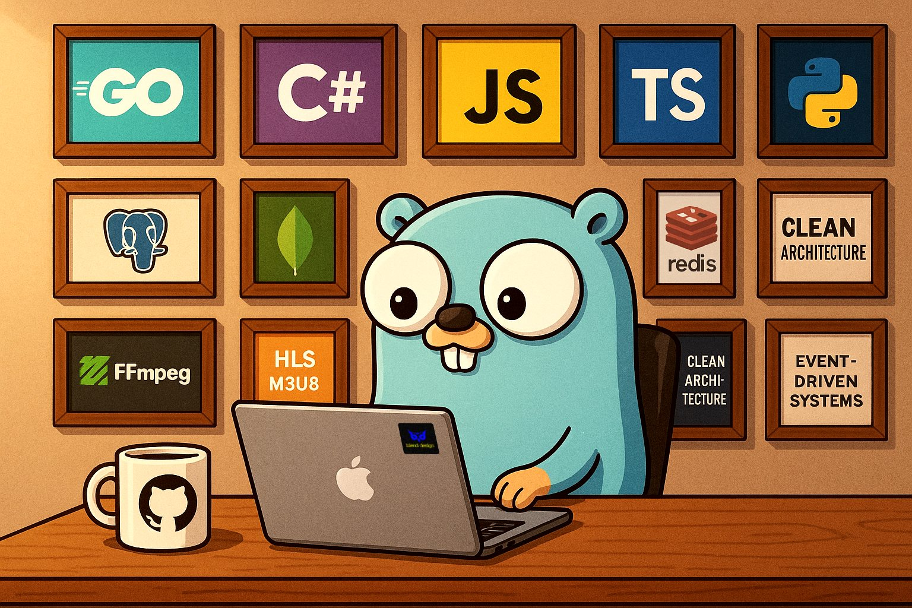

# Hi there 👋 I'm Omid Rasouli

### 🚀 Backend Engineer | Go & Distributed Systems | VOD Platforms

I'm a backend engineer passionate about **system design, distributed systems, and building scalable streaming platforms**. I love working with **Go, FFmpeg, and cloud-native tools** to design robust architectures that handle real-world challenges.

---

  

## 🛠️ Tech Stack
- **Languages:** Go, C#, JavaScript, TypeScript, Python
- **Frameworks:** Gin
- **Databases:** PostgreSQL, Redis, MongoDB
- **DevOps & Tools:** Docker, Kubernetes, GitHub Actions, CI/CD
- **Streaming & Media:** FFmpeg, HLS, M3U8, DRM
- **Architecture:** Microservices, Clean Architecture, Event-Driven Systems

---

## 📌 Featured Projects

### 🎬 [VOD Streamer EDU](https://github.com/OmidRasouli/vod-streamer-edu)
A video-on-demand streaming platform built with **Go** and **FFmpeg** following Clean Architecture principles. Supports **multi-bitrate HLS streaming, adaptive playback, encryption, and playlist generation**.

### 🐳 Cloud-Native Go Services
Microservices built with Go, containerized using Docker, and orchestrated on Kubernetes.

---

## 📈 GitHub Stats

---

## 🌍 Connect with Me

📫 Reach me at: **omidrasouli92@gmail.com**

---

⭐️ From [OmidRasouli](https://github.com/OmidRasouli)
